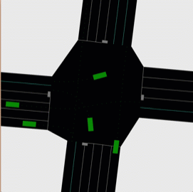
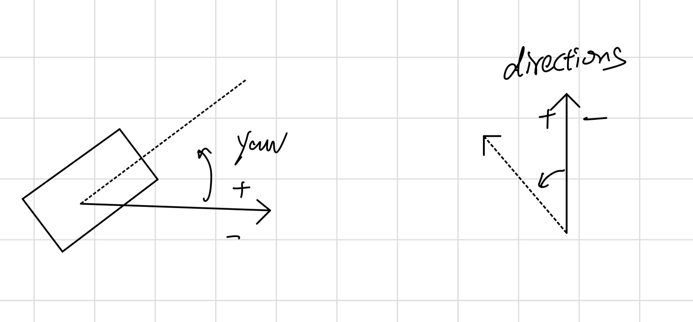
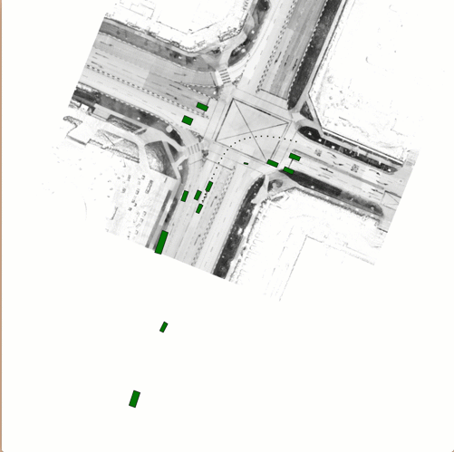

# PyTrafficSim

PyTrafficSim is a light traffic simulator for research-related purposes. PTS is the easiest way to test your self-driving algorithm within a complicated intersection scenario (except for perception, we already have tons of datasets for that). The PTS's purpose is to quickly test your algorithms under the most extreme scenarios at any machine with a Python environment. No need to look for an Ubuntu machine and no need to deal with ROS packages anymore.

To run PTS, all you need is a Python3 environment with NumPy, and that's all. Nothing more to install. If you are studying the motion planning algorithm, you can plug your algorithm or tweak the default one at `MotionPlanning.py` to check how it works. You do not need to care about other subsystems at all. It's the same story for control system researchers and decision-making system (for SDVs) researchers.

For now, the most challenging part of PTS is the decision-making system. The default algorithm `basic_policy.py` currently uses many if statements. I challenge other researchers to get better results on traffic per minute without serious crashes. To see more details about the decision-making system, check the demo decision making chapter below.

## Demo
To run the default demo, just run
```python run.py
```

Run different demo by changing the parameter of d/Demo
```python run.py -d 2
python run.py -Demo 3
```

### Demo 1: Default traffic light settings


### Demo 2: Traffic lights with specific left turn green lights

### Demo 3: Four ways stop signs / yellow flashing lights


Change the parameters in the `run.py` file to customize the simulation. Change `agent_per_second` to get fewer or more vehicles in the simulation. Change `running_time` to run a longer or shorter simulation. Change `trajectory` to True to see all trajectories for each agent.


### Demo Map
The demo map is based on a real intersection (38.64934615481847, -90.30073896398561) in front of my school in Saint Louis although the lane rules and traffic lights were changed to be more challenging. Change the `DefaultMap_4ways.py `file to get a customized map. Remember to change or add a new lanes rule dictionary if you change the number of the lanes to let the simulator know which lane is a right turn lane and which is a left turn lane. 

Traffic light schedules are also maintained in the map file. Try to change the numbers in the traffic_lights_schedules dictionary. These numbers control how long each signal runs before changing. Left and right turning lights will be supported in future versions.

### Demo Lane Chooser
Turning vehicles might sometimes just pick a random lane to enter. The default file provides two inbound lane choosers. The normal chooser will follow traffic rules, making the turning vehicle enter only the closest lane. The turning random chooser will pick a random lane to enter for turning vehicles. Customize this file to make your own inbound lane choosing strategy.    

### Demo Vehicle Model
By default, PTS is not using vehicle dynamics to move the vehicles in the current version. But we did include a simple bicycle model in the `VehicleModel.py` file. Test the model’s dynamics by running the former commented DynamicTest simulation in the `PyTrafficSim.py` (to be repaired).

### Running time
PTS tried its best to run in real-time. All metrics in PTS tried to follow real-world metrics in meters and seconds. PTS users might experience lagging due to insufficient computational power. Try to reduce the frame_rate to get a better experience. Lagging will not change the simulation result (like causing more crashes). But heavy lagging will increase the number of cars on one screen. So close the simulation if you are experiencing heavy lagging.

### Demo Decision Making
PTS supported 6 default actions for each agent to take. They are "yield", "stop", "normal", "alert" , "follow" and “yield_squeeze”. For the “follow” action, you need to maintain the target agent for the current agent to follow. The decision making system should decide what is the best action to take for the current agent to take. You can deploy different policies for each agent if you want. The response of each action is implemented in the speculate() function in the `PyTrafficSim.py` file.

- Yield = decrease speed and stop (Pink)
- Yield_squeeze = decrease speed and stop for a squeezing vehicle (Pink)
- Stop = emergency stop (White)  # this is not used based on former simulations
- Normal = drive at a cruising speed (Green)
- Alert = drive at an alert speed (Cyan)

### Coordinates
See the following figure for the coordinate settings for yaw and directions in the project.


### Load data from other datasets
In v0.3, I tried to load vehicle traveling data from other professional datasets to verify the PyTrafficSim's ability to predict trajectory. I chose the prediction problem data from [NuScene](https://www.nuscenes.org/) and loaded the number zero scene in the PyTrafficSim. The result is shown in the below gif. Try to uncomment the last part code in the `run.py` script to run it by yourself. 
 

Before you run this part of the code, you need to install the PythonSDK from the website of NuScenes. You also need to download the mini-val data and all the maps to the data folder. Rectify the directory of data and maps in the script of `DataLoader.py`.

Note that the default polynomial-based trajectory generation is quite capable of predicting the future trajectory with limited errors. This fact pushed me to rethink the problem of trajectory prediction.

### Join the project
PTS is meant to be an open project and it is in the earliest stage. Contact me if you are interested.


